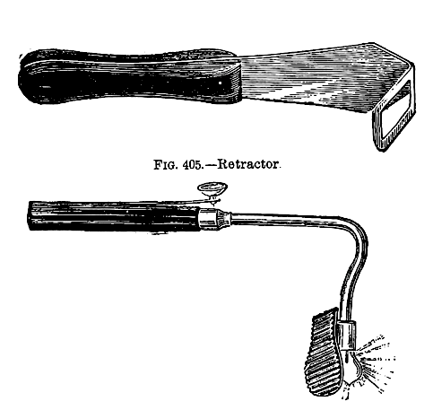

# E2E Testing for React Apps

[](https://travis-ci.org/LiquidLabsGmbH/retractor)

Retractor exposes the internals of a React application for end-to-end testing purposes. This allows you to select DOM nodes based on the name of the React Component that rendered the node as well as its state or properties.


> A retractor is a surgical instrument with which a surgeon can either actively separate the edges of a surgical incision or wound, or can hold back underlying organs and tissues, so that body parts under the incision may be accessed. – [Wikipedia][wikipedia]



## Example

```js
import webdriver from 'selenium-webdriver';
import retractor from 'retractor';
import TodoItem from './components/TodoItem';

/* @jsx retractor */

const driver = new webdriver.Builder().forBrowser('firefox').build();

driver.get('http://localhost:3000/');

// Find all TodoItems
driver.findElements(<TodoItem />);

// Find one TodoItem with a given text
driver.findElement(<TodoItem todo={{ text: /Use retractor/ }} />);
```

## Installation

First install Retractor via npm:

```
$ npm install --save-dev retractor
```

Next include retractor in your page __before__ React gets loaded. In a [webpack](https://webpack.github.io/) based setup this can be achieved by adding `'retractor'` to the beginning of the `entry` array:

```javascript
// webpack.config.js

var config = {
  entry: [
    './index' //your application entry
  ],
  output: {},
  plugins: [],
  module: {
    loaders: []
  }
};

// Add retractor if not running in production
if (process.env.NODE_ENV !== 'production') {
  config.entry.unshift('retractor');
}

module.exports = config;
```

You can verify that Retractor is installed by typing `__retractor` in your Browser's console.


## Usage

Once Retractor is included in your page you can use it in your Selenium tests. In order to do so, you have to add a [jsx pragma](http://babeljs.io/docs/plugins/transform-react-jsx/#custom) to your tests:

```js
/* @jsx retractor */
```

With this setting, JSX expressions will no longer translate into `React.createElement()` calls, but will use `retractor()` instead.

This in turn will create a locator function that can be passed to the WebDriver [`findElement()`](http://seleniumhq.github.io/selenium/docs/api/javascript/module/selenium-webdriver/index_exports_WebDriver.html#findElement) method.

Retractor uses [deep-match](https://www.npmjs.com/package/deep-match) to compare the specified props with the actual components. Props that are not mentioned in the locator are ignored. Functions and regular expressions in the locator will be run against the corresponding prop values.

[wikipedia]: https://en.wikipedia.org/wiki/Retractor_(medical)

# License

MIT
